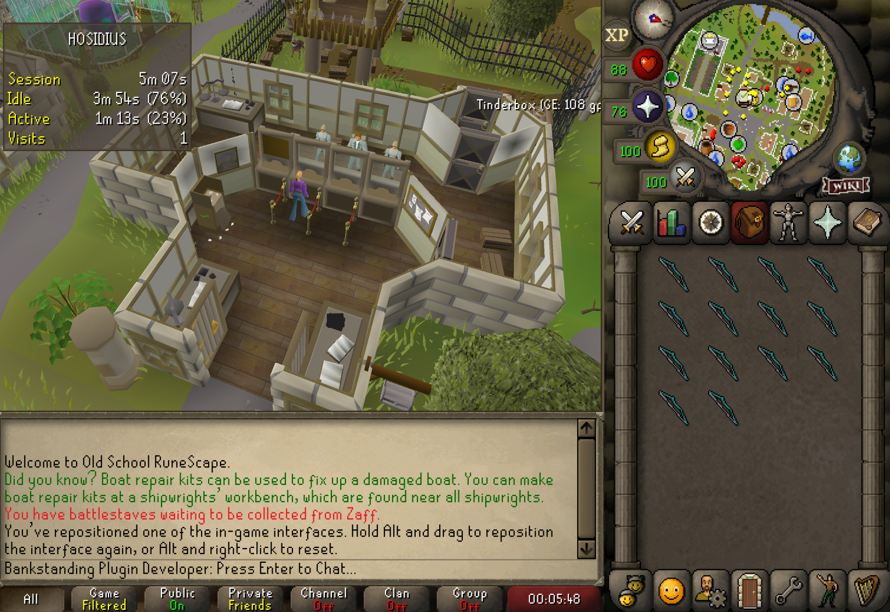
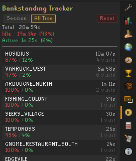

# Bankstanding

A Runelite plugin that awards you for doing nothing!

## Features

* The plugin tracks player events such as moving, chatting and gaining exp
* It uses this information to see 'how afk' the player is
* Awards the player experience points in Bankstanding for the time spent idle.
* Adds an overlay indicating the current level and progress to level-up.
* Adds an "!lvl bankstanding" command to brag about how AFK you have been.
* Additionally, tracks time spent in the banks or Gielinor.
* Provides a side panel with time spent idle/active and shows visits per bank.

## Bank-bug bounty

Bank areas are manually mapped and mostly taken from the Wiki. There *will* be missing or incorrectly placed bank's. 
If you find a missing or incorrectly placed bank, please report these using the "Missing or incorrect bank" template 
on GitHub. Reporters will receive a 100K bounty when the location is added.

## Examples

**Bankstanding Level**

**Banking session**

**Banking stat panel**

